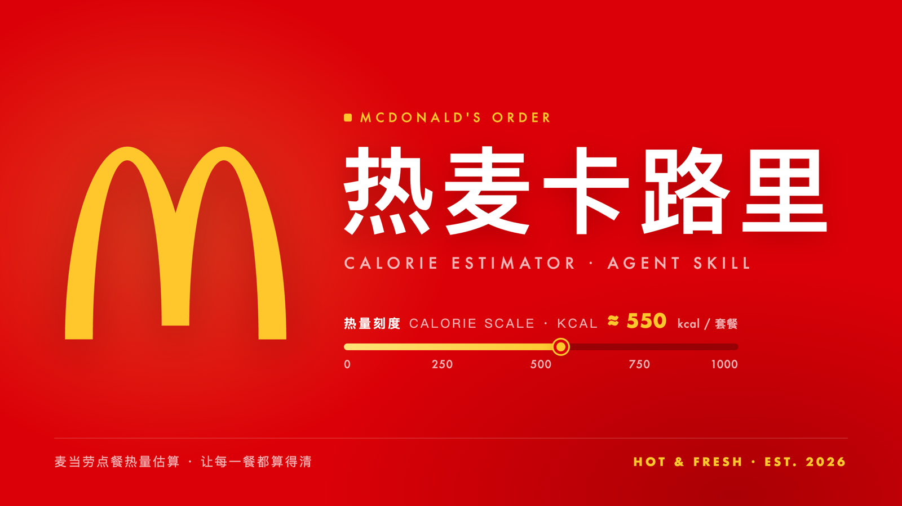

<div align="center">
  
</div>

# 热麦卡路里

> 麦当劳订单热量估算与餐段档位套餐推荐 · Agent Skill · 麦当劳程序员节创意开发大赛参赛作品


「热麦卡路里」是一套以对话方式运行的 **Agent Skill**：读取一笔麦当劳订单 → 估算整单热量 → 对照所处餐段的热量档位给出结论 → 按餐段与档位推荐门店当前可售的套餐 → 给出更轻的替换方案 → 在用户确认金额后下单。

底层能力全部来自麦当劳中国官方 MCP 服务 [`M-China/mcd-mcp-server`](https://github.com/M-China/mcd-mcp-server)（营养表、订单查询、门店菜单、优惠券、报价下单）；本 Skill 负责把这些原子接口编排成一条可对话、可复用的闭环流程。所有热量计算由本地纯 Python 脚本完成，不联网、无第三方依赖。

> 本项目为参赛作品形态，**非麦当劳官方产品**；餐品信息、价格及供应状态以麦当劳官方渠道实时结果为准。热量为估算参考，不构成医学、减重或疾病饮食建议。

---

## 目录

| 分区 | 内容 |
|---|---|
| [1. 30 秒看懂](#1-30-秒看懂) | 一句话定位、能力矩阵、适合谁 |
| [2. 快速开始](#2-快速开始) | 3 步跑起来（含 MCP 配置） |
| [3. 核心能力](#3-核心能力) | 六项能力的输入 / 输出口径 |
| [4. 工作流](#4-工作流ag) | A–G 链路的触发语与流程 |
| [5. 餐段与档位口径](#5-餐段与档位口径) | 档位热量表、±12% 筛选规则 |
| [6. 对话示例](#6-对话示例) | 4 个真实对话样例（含实测输出） |
| [7. 离线命令行自测](#7-离线命令行自测) | 不装 MCP 也能跑的脚本与评测 |
| [8. 项目结构](#8-项目结构) | 仓库文件树 |
| [9. 架构拓扑](#9-架构拓扑) | 三层结构与调用方向 |
| [10. 已知限制](#10-已知限制) | 覆盖率、歧义、缓存与限流 |
| [11. 边界与合规](#11-边界与合规) | 安全红线与数据纪律 |
| [12. FAQ](#12-faq) | 常见问题 |
| [13. 参赛信息](#13-参赛信息) | 赛事、工具链、版本 |

---

## 1. 30 秒看懂

**一句话**：给它一个订单号，它告诉你这单多少热量、落在哪个档位、想轻一点该怎么换，并能在你确认金额后代你下单（支付仍由你自己完成）。

| 能力 | 你说 | 它做 | 依赖 |
|---|---|---|---|
| A. 订单热量估算 | 「这单多少热量？订单号 xxx」 | 展开套餐 → 逐项匹配营养表 → 整单合计 + 档位结论 | `query-order` |
| B. 档位推荐 | 「想吃 300 大卡左右的早餐」 | 取该餐段实时菜单 → 枚举组合 → ±12% 筛选 → Top 3–4 | `query-meals` |
| C. 替换建议 | 「昨天那单偏高，今天来点轻的」 | 高于标准档则切标准档 → 输出更轻组合 + 少多少 kcal | `query-meals` |
| D. 一键导入历史订单 | 「导入我的历史订单分析热量」 | `order-list` 原始响应 → 自动脱敏落盘 → 逐单算热量 → 排行与汇总 | `order-list` |
| D2. 历史订单复盘 | 「我最近都吃了些什么」 | 已脱敏样本逐单算热量、按餐段比对、出排行 | `mcd_import.py --no-deidentify` |
| E. 安全下单 | 「就按推荐第 1 组帮我下单」 | 查券（只标注）→ 报价 → **确认闸门** → 创建订单 | `calculate-price` / `create-order` |
| F. 全量目录（离线兜底） | —（后台能力） | 多份菜单快照聚合为 `catalog.json` + 营养缺口清单 | `query-meals` 快照 |

**适合谁**

- 关注热量 / 体重管理的普通消费者——快速知道「这单吃了多少」，避免无意间超标；
- 有控卡需求的轻健身人群——正餐之外迅速找到「300 大卡左右的轻食组合」；
- 精打细算型食客——在不超预算、不超热量的前提下拿到门店当前可售的最优组合；
- 开发者 / 参赛者——参考如何把 MCP 的原子能力编排成一个可对话、可复用的 Skill。

---

## 2. 快速开始

### 前置条件

| 项 | 要求 |
|---|---|
| MCP Token | 麦当劳中国 MCP Token（[申请指引](https://github.com/M-China/mcd-mcp-server)） |
| 客户端 | 任意支持 MCP 的客户端；本作品推荐使用官方合作伙伴 [WorkBuddy](https://www.workbuddy.cn/) |
| 运行环境 | 本地脚本需 Python 3.10+（仅离线自测需要，无第三方依赖） |

### 步骤 1：接入麦当劳 MCP

WorkBuddy 左侧【专家·技能·连接器】→【连接器】→【自定义连接器】→【配置 MCP】，填入：

```json
{
  "mcpServers": {
    "mcd-mcp": {
      "type": "streamablehttp",
      "url": "https://mcp.mcd.cn",
      "headers": {
        "Authorization": "Bearer YOUR_MCP_TOKEN"
      }
    }
  }
}
```

> ⚠️ 将 `YOUR_MCP_TOKEN` 替换为你的真实 Token，保存并**启用** `mcd-mcp`。Token 只存在于客户端配置，不会进入对话、日志或演示材料。

### 步骤 2：加载本 Skill

把仓库里的 `skill/` 目录整体复制到 WorkBuddy 用户技能目录，并重命名为 `mcd-calorie-combo`：

```bash
cp -r skill/ ~/.workbuddy/skills/mcd-calorie-combo/
```

重启客户端后，Skill 即以 `mcd-calorie-combo` 生效（`skill/SKILL.md` 中的 `name` 字段）。

### 步骤 3：开始对话

直接用触发语即可，例如：

- 「这单多少热量？订单号 9900004064」
- 「想吃 300 大卡左右的早餐」
- 「昨天那单偏高，今天来点轻的」
- 「吃饱但钠低一点」

---

## 3. 核心能力

- **订单热量估算** — 按 `comboItemList` 展开套餐，「加…(加)」类加料剥离且热量不计入并明确告知；匹配不上的项标注「热量未知」，合计改口为「**≥ N kcal**」，**绝不按 0 计算**。
- **餐段识别** — 默认取当前时间判定（早餐 / 午餐 / 随便吃吃 / 晚餐 / 宵夜），也支持用户显式指定；门店实际时段优先于固定兜底（各店不同，且宵夜存在跨零点段）。
- **档位推荐** — 按「餐段 + 档位（轻量 / 标准 / 吃饱）」枚举当前餐段菜单里的可行组合（1 主食 + 0~1 小食 + 0~1 饮品），四种排序：最接近档位 / 蛋白质更高 / 钠更低 / 价格更低。
- **目标场景推荐** — 在餐段档位之上叠加 13 个目标场景：减脂 / 增重 / 练后餐 / 放纵餐 / 低钠控盐 / 高蛋白增肌 / 低糖低碳水 / 低脂清淡 / 素食蛋奶素 / 儿童小份量 / 热量预算日控 / 过敏原规避 / 性价比省钱。场景自动切换档位、排序策略与硬上限（如低钠 ≤1000mg、低碳 ≤60g、按剩余预算配餐）。
- **替换建议** — 整单高于该餐段标准档时，给出更轻的替换组合与「少多少 kcal」的对比。
- **历史复盘** — 批量回顾近期订单，输出热量排行、超标准档的单子、平均热量与未知项占比。
- **一键导入历史订单** — 把 `order-list` 的原始响应（含订单号/门店等敏感字段）交给脚本，自动完成脱敏、落盘、逐单热量估算与汇总，一条命令出报告。
- **安全下单** — 查券（只标注，不参与排序）→ 报价 → **必须展示金额并获得用户明确确认** → 创建订单，返回支付链接由用户自付；本 Skill 不代付。

---

## 4. 工作流（A–G）

| 阶段 | 触发语 | 说明 |
|---|---|---|
| **A** 订单热量估算 | 「这单多少热量？」 | 订单号 → 展开套餐 → 逐项匹配营养表 → 整单合计 + 档位对比 |
| **B** 档位推荐 | 「想吃 300 大卡左右的早餐」 | 取该餐段菜单 → 枚举组合 → 按档位 ±12% 筛选 → 展示 Top 3–4 |
| **C** 替换建议 | 「昨天那单偏高」 | 高于标准档则切标准档，输出替换组合 + 少多少 kcal |
| **D** 一键导入历史订单 | 「导入我的历史订单分析热量」 | `order-list` 原始响应 → 自动脱敏落盘 → 逐单热量 → 排行与汇总 |
| **D2** 历史订单复盘 | 「我最近都吃了些什么」 | 已脱敏样本 → 逐单热量 → 餐段比对 → 排行与汇总 |
| **E** 下单 | 用户明确要求 | 查券（仅标注）→ 报价 → 确认闸门 → 创建订单 |
| **F** 全量目录 | 离线兜底 | 多份菜单快照聚合为 `catalog.json` / `nutrition-gaps.json` |
| **G** 目标场景推荐 | 「减脂吃什么」「想控盐」「吃素」「今天还剩 600 卡」 | 场景切换档位与排序，叠加硬上限（钠/碳水/脂肪/价格/预算）与关键词排除 |

> 下单流程设有**不可绕过的确认闸门**：报价展示后必须以明确问句收尾，只有收到肯定答复才调用 `create-order`。详见 [`skill/docs/order-flow.md`](skill/docs/order-flow.md) 与 [`MCP_INTEGRATION.md`](MCP_INTEGRATION.md)。
>
> **纪律**：F 生成的目录只用于离线匹配与兜底；推荐候选**必须**取自当次 `query-meals` 实时返回——价格随餐段浮动，目录价会过期。

---

## 5. 餐段与档位口径

档位目标值（kcal），筛选区间为目标值 **±12%**：

| 餐段 | 轻量 | 标准 | 吃饱 | 兜底时段 |
|---|---|---|---|---|
| 早餐 | 300 | 450 | 600 | 05:00–10:30 |
| 午餐 | 500 | 750 | 1000 | 10:30–15:30 |
| 随便吃吃（下午茶） | 150 | 300 | 450 | 15:30–17:59 |
| 晚餐 | 500 | 750 | 1000 | 18:00–22:00 |
| 宵夜（单列档） | 300 | 450 | 600 | 22:00–23:59、00:00–05:59 |

补充规则：

- **宵夜为单列档位**，不并入晚餐；跨零点段（如 `00:00–04:45`）以门店实测 `reservationTimeOptions` 为准。
- 门店时段**实测优先**：各店营业餐段不同，`query-meals` 需传 `reservationDate` = 目标餐段代表时刻（接口无 `daypart` 字段）。
- 档位内无解时提示换档位，**不放宽 ±12% 筛选**。
- 历史订单的餐段优先取订单自带时间，而非当前时刻。

---

## 6. 对话示例

**示例 1 — 订单热量估算**

```
用户：这单多少热量？订单号 9900004064
WorkBuddy：
  【订单估算】订单 SAMPLE-20261009-01 · 餐段 午餐 · 档位 标准（目标 750 kcal）
   ✓ 板烧鸡腿堡       391 kcal｜钠 1041mg
   ✓ 中薯条           289 kcal｜钠  165mg
   ✓ 可乐中杯         147 kcal｜钠    0mg
   整单：827 kcal
   结论：落在本餐段标准档范围内，合适
```

**示例 2 — 餐段档位推荐**

```
用户：想吃 300 大卡左右的早餐
WorkBuddy：
  【推荐 · 早餐 · 轻量】目标 300 kcal（区间 264–336，命中 7 组，排序 near）
   1. 猪柳麦满分                    308 kcal｜蛋白 16g｜钠 781mg｜≈¥14.0
   2. 猪柳麦满分 + 锡兰红茶          310 kcal｜蛋白 16g｜钠 781mg｜≈¥25.5
   3. 猪柳麦满分 + 麦咖啡热美式中杯   321 kcal｜蛋白 17g｜钠 781mg｜≈¥25.9
```

**示例 3 — 替换建议**

```
用户：昨天那单偏高，今天来点轻的
WorkBuddy：基于你的午餐标准档 750 kcal，替换组合：
   鲜煮咖啡 + 那么大鸡排（轻） → 约 520 kcal，较原单少 ~307 kcal
```

**示例 4 — 安全下单**

```
用户：就按推荐第 1 组帮我下单（到店）
WorkBuddy：报价 ¥14.0（原价 ¥14.0 / 优惠 ¥0.0 / 应付 ¥14.0），到店取餐。确认按此下单吗？
用户：确认
WorkBuddy：已创建订单，支付链接：https://…（请自行支付，本助手不代付）
```

**示例 5 — 历史订单复盘**

```
用户：我最近都吃了些什么？哪天吃重了
WorkBuddy：
  【历史复盘】订单数 8｜平均 1086 kcal｜超标准档 6 单
   2025-11-22 18:28  晚餐   8 项  2243 kcal  标准档 750  偏高 +1493
   2025-10-11 13:26  午餐   5 项  1470 kcal  标准档 750  偏高  +720
   2026-03-20 18:32  晚餐   5 项   987 kcal  标准档 750  偏高  +237
   …
   商品项 39｜热量未知 4 项（10.3%）｜歧义待选 0 项
   最重的一单可交给替换流程生成更轻方案。
```

> 示例 1、2、5 为 `skill/fixtures` 样本上的**实测脚本输出**；示例 3、4 为交互形态示意。

---

## 7. 离线命令行自测

不配置 MCP、不联网也能验证核心算法（输入均来自 `skill/fixtures` 实测快照）：

```bash
# A. 估算一笔订单的热量合计 + 档位结论
python skill/scripts/mcd_order.py --order skill/fixtures/order.sample-01-lunch-combo.json

# B. 推荐某餐段某档位的组合（按最接近档位排序）
python skill/scripts/mcd_combo.py \
  --menu skill/fixtures/meals.3570190.dinein.breakfast.json \
  --daypart 早餐 --tier 轻量 --sort near --top 3

# D. 一键导入历史订单（原始响应 → 自动脱敏 → 逐单热量分析）
python skill/scripts/mcd_import.py --raw <order-list 原始响应.json> --out skill/data/history-orders.json

# D2. 历史订单批量复盘（已脱敏样本，跳过脱敏）
python skill/scripts/mcd_import.py --raw skill/fixtures/order-list.sample.json --no-deidentify

# 名称匹配率评测（验收 ≥90%）
python skill/tools/eval_match.py
```

**评测结果（2026-10-10 实测）**

| 口径 | 结果 | 结论 |
|---|---|---|
| 常见订单集（验收口径） | **12/13 = 92.3%**（歧义 1，未知 0） | ✅ PASS（≥90%） |
| 压力样本（边界验证） | 4/8 = 50.0%（歧义 2，未知 2） | 用于验证 UNKNOWN 保护路径 |

未命中项全部显式标注为「歧义（待确认规格）」或「未知」，无按 0 计算的路径。

---

## 8. 项目结构

```
热麦卡路里/
├── skill/                          # Agent Skill 源码（核心交付物）
│   ├── SKILL.md                    # Skill 定义：触发词 / 工具链 / 工作流 A–F / 边界
│   ├── data/
│   │   ├── alias.json              # 别名表 + 有证据的默认规格
│   │   ├── category-rules.json     # 品类兜底关键词
│   │   ├── catalog.json            # 全量目录（179 商品：单品 90 / 套餐 SKU 89）
│   │   └── nutrition-gaps.json     # 营养缺口：未收录单品 + 规格歧义
│   ├── docs/                       # nutrition-schema / store-chain / order-flow
│   │                               # catalog-collection / e2e-run
│   ├── fixtures/                   # 实测快照
│   │                               # 营养表 / 菜单×5 餐段 / 套餐详情×3
│   │                               # 订单样本×6 / 脱敏历史订单
│   ├── scripts/                    # 本地计算脚本（Python 3.10+，无第三方依赖）
│   └── tools/eval_match.py         # 名称匹配率评测
├── cover/                          # 封面源（HTML 排版 + 渲染脚本 + 官方金拱门矢量）
├── assets/                         # Logo 与品牌素材（金拱门 SVG / 深浅底版本）
├── README.md                       # 本文件
├── 架构拓扑.txt                     # ASCII 架构拓扑源文件
├── CONTEST_DECLARATION.md          # 参赛声明（原创性 / 合规性 / 敏感信息）
├── MCP_INTEGRATION.md              # 实际使用的 MCP Server / Tool / 流程 / 价值
├── project-engineering-file.md     # 工程实施记录
├── workbuddy.md                    # WorkBuddy 开发对话上下文导出
├── 订单热量与套餐推荐 Skill PRD.md  # 产品需求文档
└── 实施计划.html / 演示页.html / 点餐页.html   # 演示材料（均标注「模拟」）
```

### 本地脚本（`skill/scripts/`，Python 3.10+，无第三方依赖）

| 脚本 | 职责 |
|---|---|
| `mcd_nutrition.py` | 营养表解析 / 名称归一化 / 四级匹配器（UNKNOWN 保护） |
| `mcd_daypart.py` | 餐段时段解析（门店实测 > 固定兜底）+ 档位表 `TIERS` |
| `mcd_goal.py` | 目标场景策略层（13 场景定义 + 场景评分器 + 硬上限/关键词排除 + 计划解析） |
| `mcd_combo.py` | 品类三级归类 + 组合枚举 + 档位筛选 + 排序 + 场景推荐 |
| `mcd_order.py` | 订单展开（兼容 `productName` / `name`）+ 加料剥离 + 合计与档位对比 |
| `mcd_replace.py` | 替换建议（标准档触发规则） |
| `mcd_import.py` | 一键导入历史订单（原始响应 → 自动脱敏 → 逐单热量与档位对比） |
| `mcd_history.py` | 历史订单批量复盘（已脱敏样本 → 逐单热量与档位对比） |
| `mcd_catalog.py` | 全量目录聚合（多快照 → `catalog.json` / `nutrition-gaps.json`） |
| `build_demo_menu.py` | 演示用菜单数据构建（仅演示材料使用） |
| `tools/eval_match.py` | 匹配率评测（常见订单集 ≥90% 验收，实测 92.3%） |

---

## 9. 架构拓扑

三层结构：对话编排层不直接算数，本地计算层纯 Python、无第三方依赖、无网络，所有外部调用只发生在 MCP 对话层。`▼` 表示调用 / 依赖方向。

```text
     ┌────────────────────────────────────────────────────────────────────────────────────┐
     │                     对话编排层 · SKILL.md（mcd-calorie-combo）                     │
     │     MCP 工具：now-time-info · query-order / order-list · list-nutrition-foods      │
     │     query-meals(reservationDate) · query-meal-detail · 门店链 nearby/delivery      │
     │        query-store-coupons · calculate-price · create-order（下单确认闸门）        │
     │       工作流：A 订单估算 / B 档位推荐 / C 替换 / D 历史复盘 / E 下单 / F 目录       │
     └────────────────────────────────────────────────────────────────────────────────────┘
                                                │
                ┌───────────────────────────────┼───────────────────────────────┐
                ▼                               ▼                               ▼
┌──────────────────────────┐    ┌──────────────────────────┐    ┌──────────────────────────┐
│       mcd_order.py       │    │       mcd_combo.py       │    │      mcd_replace.py      │
│   订单展开 · 加料剥离    │    │ 三级品类归类 · 组合枚举  │    │替换建议 · 差异输出（F4） │
│ 估算 · 档位对比（F1/F2） │    │  ±12% 筛选 · 排序（F3）  │    │       超标切标准档       │
└──────────────────────────┘    └──────────────────────────┘    └──────────────────────────┘
                │                               │                               │
                └─────────┬─────────────────────┴─────────────────────┬─────────┘
                          ▼                                           ▼
┌──────────────────────────────────┐        ┌──────────────────────────────────┐
│         mcd_nutrition.py         │        │          mcd_daypart.py          │
│      营养解析 · 名称归一化       │        │     门店时段解析 · 餐段判定      │
│     四级匹配 · UNKNOWN 保护      │        │     档位表 TIERS · 宵夜单列      │
└──────────────────────────────────┘        └──────────────────────────────────┘
                          │                                           │
                          └─────────────────────┬─────────────────────┘
                                                ▼
        ┌──────────────────────────────────────────────────────────────────────────────┐
        │          数据缓存层 · data/ + fixtures/ + docs/（纯本地 · 无网络）           │
        │alias.json · category-rules.json · catalog.json · nutrition-gaps.json         │
        │营养表 / 菜单×5餐段 / 套餐详情 / 订单样本×6 / 脱敏历史订单                   │
        └──────────────────────────────────────────────────────────────────────────────┘

※ mcd_import.py：一键导入历史订单（order-list 原始响应 → 自动脱敏 → 逐单热量与档位对比）
※ mcd_history.py：历史订单批量复盘（已脱敏样本 → 逐单热量与档位对比）
※ mcd_goal.py：目标场景策略层（G）——13 场景：减脂/增重/练后餐/放纵餐/低钠/高蛋白/低碳/低脂/素食/儿童/预算/过敏原/性价比
※ tools/eval_match.py：匹配率评测（复用 nutrition + order）· 验收 ≥90% · 实测 92.3% PASS
※ 外部系统：麦当劳中国官方 MCP（M-China/mcd-mcp-server）· 限流 600 次/分 · Token 仅在客户端配置
※ 缓存策略：营养表 ≥24h · 菜单按 店+餐段 10min · 429 指数退避
```

> 拓扑源文件：[`架构拓扑.txt`](架构拓扑.txt)。

---

## 10. 已知限制

诚实说明当前版本的边界，避免误用：

| 限制 | 现状 | 处理策略 |
|---|---|---|
| 营养表覆盖率 | 官方营养表对**当前在售单品覆盖率 44.4%**（单品 40/90，实测门店 3570190；全量含套餐 60/179） | 未收录项标「热量未知」，合计改口「≥ N kcal」；缺口清单见 `data/nutrition-gaps.json` |
| 名称歧义 | 可乐 / 薯条 / 新地 / 派等缺规格的商品存在多个候选 | 列出候选让用户确认，**不猜规格**；部分规格用有证据的默认值（`isDefault=1`） |
| 已下架 / 限定品 | 历史订单里可能出现营养表已无记录的商品 | 缺口清单中标 `origin=history-order`，同样走 UNKNOWN 保护 |
| 价格浮动 | 价格随餐段、门店变动 | 推荐候选与报价一律取**当次实时返回**，`catalog.json` 仅作离线兜底 |
| 接口限流 | 600 次/分钟 | 营养表缓存 ≥24h、菜单按「店 + 餐段」缓存 10min，429 指数退避 |
| 餐段时段 | 各店不同，存在跨零点宵夜段 | 门店实测 `reservationTimeOptions` 优先，固定时段仅作兜底 |

---

## 11. 边界与合规

- 热量为**估算参考**，不提供医学 / 减重 / 疾病饮食建议，不给「你应该吃多少」的处方。
- 营养表调用失败或为空 → 仅提示稍后重试，**不凭记忆给热量数字**。
- 不使用官方商品图片与商标素材；演示材料均标注「模拟」。
- Token 只在 MCP 客户端配置，不写入对话、日志或演示页。
- 历史订单落盘前**必须脱敏**（去 `orderId` / `storeCode` / `storeName` / `beCode`）。
- 下单前必须展示金额并获得用户明确确认；本 Skill 不代付。

---

## 12. FAQ

**Q：没有 MCP Token 能用吗？**
能跑一部分。`skill/scripts/` 下的脚本是纯本地的，用 `skill/fixtures` 里的实测快照可完整验证热量估算、档位推荐与匹配率（见[第 7 节](#7-离线命令行自测)）；但实时菜单、报价与下单必须有 MCP。

**Q：为什么有些商品显示「热量未知」而不是 0？**
官方营养表并未收录全部在售单品（单品覆盖率 44.4%，实测门店 3570190）。按 0 计算会让整单热量被低估，因此未命中项一律标注为未知，合计表述为「≥ N kcal（实际会更高）」。

**Q：推荐结果为什么和 App 里看到的价格不一样？**
价格随餐段与门店浮动。所有推荐与报价都取自当次 `query-meals` / `calculate-price` 的实时返回，不使用缓存目录里的价格。

**Q：它会替我付款吗？**
不会。下单流程只到「创建订单并返回支付链接」，支付由你本人完成；且创建订单前必须展示金额并得到你的明确确认。

**Q：档位 300 / 450 / 600 是怎么定的？**
是本项目设定的参考档位，用于把「这单算不算多」变成可比较的刻度，不构成任何饮食建议。可按需要在 `skill/scripts/mcd_daypart.py` 的 `TIERS` 中调整。

**Q：宵夜为什么单列？**
实测门店宵夜时段（约 22:14 起，含跨零点段）的供应与正餐不同，热量需求也更低，因此单独设档（300 / 450 / 600），不并入晚餐。

---

## 13. 参赛信息

- 赛事：**麦当劳程序员节创意开发大赛**（[活动仓库](https://github.com/M-China/mcd-developer-innovation-challenge)）
- 开发工具：**WorkBuddy**（官方合作伙伴），开发对话上下文见 [`workbuddy.md`](workbuddy.md)
- 底层能力：麦当劳中国官方 MCP [`M-China/mcd-mcp-server`](https://github.com/M-China/mcd-mcp-server)
- 当前版本：**v0.7.0**

---

*本项目为 Agent Skill 参赛作品形态，核心交付物为 `skill/` 目录，配套 PRD、演示页与参赛声明文档。*
